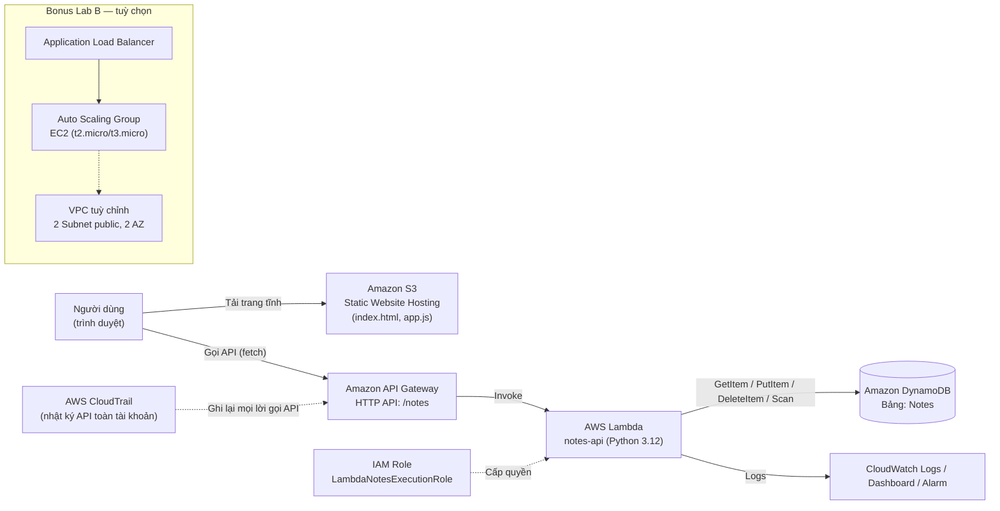

# CloudNote — Workshop triển khai ứng dụng Serverless trên AWS Free Tier
### Capstone Project — Chương trình thực tập *First Cloud AI Journey (FCAJ)*
**Sinh viên:** Phạm Thùy Dung · MSSV 0205568 · Lớp 68CNCS — Khoa Công nghệ thông tin, Trường Đại học Xây dựng Hà Nội
**Đơn vị hướng dẫn:** Công ty TNHH Amazon Web Services Việt Nam
**Đề tài:** First Cloud AI Journey — Capstone: *CloudNote*

---

## Mục lục

1. [Giới thiệu & mục tiêu](#1-giới-thiệu--mục-tiêu)
2. [Kiến trúc hệ thống](#2-kiến-trúc-hệ-thống)
3. [Chuẩn bị trước khi bắt đầu](#3-chuẩn-bị-trước-khi-bắt-đầu)
4. [PHẦN A — Ứng dụng ghi chú Serverless (lõi capstone)](#phần-a--ứng-dụng-ghi-chú-serverless-lõi-capstone)
   - A0. Tạo IAM user thực hành (không dùng root)
   - A1. Tạo bảng DynamoDB
   - A2. Tạo IAM Role cho Lambda
   - A3. Tạo Lambda function (backend CRUD)
   - A4. Tạo API Gateway (HTTP API) và kết nối Lambda
   - A5. Kiểm thử API
   - A6. Tạo S3 bucket, bật Static Website Hosting, tải frontend lên
   - A7. Kiểm thử end-to-end trên trình duyệt
   - A8. Giám sát với CloudWatch (Dashboard + Alarm)
   - A9. Bật AWS CloudTrail (nhật ký kiểm toán)
5. [PHẦN B (Bonus) — Hệ thống mạng & máy chủ có khả năng mở rộng](#phần-b-bonus--hệ-thống-mạng--máy-chủ-có-khả-năng-mở-rộng)
   - B1. Tạo VPC tuỳ chỉnh
   - B2. Tạo Launch Template cho EC2
   - B3. Tạo Target Group & Application Load Balancer
   - B4. Tạo Auto Scaling Group
   - B5. Kiểm thử cân bằng tải
   - B6. (Nâng cao – tuỳ chọn) Đóng gói Docker & triển khai ECS Fargate
6. [Sản phẩm demo & cách trình bày](#6-sản-phẩm-demo--cách-trình-bày)
7. [Dọn dẹp tài nguyên (Clean-up)](#7-dọn-dẹp-tài-nguyên-clean-up)
8. [Ước tính chi phí (Budget)](#8-ước-tính-chi-phí-budget)
9. [Khắc phục sự cố thường gặp](#9-khắc-phục-sự-cố-thường-gặp)
10. [Tài liệu tham khảo](#10-tài-liệu-tham-khảo)

---

## 1. Giới thiệu & mục tiêu

**CloudNote** là một ứng dụng ghi chú (notes app) chạy hoàn toàn trên kiến trúc **serverless** của AWS, được xây dựng để hoàn tất mục tiêu Capstone Project trong kế hoạch thực tập TTTN-02: *"Dự án Capstone Project xây dựng ứng dụng thực tế trên AWS Free Tier."*

Người dùng có thể:
- Mở một trang web (host trên S3) để xem danh sách ghi chú;
- Thêm ghi chú mới, sửa, xoá ghi chú qua giao diện web;
- Toàn bộ dữ liệu được lưu và xử lý serverless (không cần quản lý máy chủ).

Workshop được chia làm 2 phần:

| Phần | Nội dung | Dịch vụ AWS sử dụng | Tương ứng tuần trong TTTN-02 |
|---|---|---|---|
| **A — Lõi capstone** | Ứng dụng ghi chú serverless đầy đủ, có demo chạy thật | IAM, S3, DynamoDB, Lambda, API Gateway, CloudWatch, CloudTrail | Tuần 1, 2, 4 |
| **B — Bonus mở rộng** | Hệ thống web tier có khả năng mở rộng ngang | VPC, EC2, ALB, Auto Scaling, (ECS/Docker – nâng cao) | Tuần 3, 5 |

> **Nguyên tắc xuyên suốt:** làm đến đâu, hiểu đến đó. Mỗi bước đều có mục đích rõ ràng — không copy-paste mù quáng. Sau mỗi phần lớn, hãy dừng lại và chụp ảnh màn hình để đưa vào báo cáo thực tập.

---

## 2. Kiến trúc hệ thống



**Giải thích luồng chính (Phần A):**
1. Người dùng mở URL website tĩnh trên S3 → nhận về `index.html` + `app.js`.
2. `app.js` gọi API (`fetch`) tới endpoint của API Gateway.
3. API Gateway định tuyến request tới Lambda function `notes-api`.
4. Lambda dùng IAM Role được gán để đọc/ghi bảng DynamoDB `Notes`.
5. Kết quả trả ngược qua API Gateway → hiển thị trên trình duyệt.
6. CloudWatch ghi log & cảnh báo lỗi; CloudTrail ghi lại mọi lệnh gọi API trong tài khoản để phục vụ kiểm toán.

---

## 3. Chuẩn bị trước khi bắt đầu

**Yêu cầu:**
- Có tài khoản AWS (khuyến khích tài khoản mới để hưởng Free Tier 12 tháng). Đăng ký tại https://aws.amazon.com/free
- Thẻ thanh toán hợp lệ để xác minh tài khoản (AWS sẽ không tính phí nếu bạn ở trong hạn mức Free Tier và dọn dẹp đúng hướng dẫn ở Mục 7).
- Trình duyệt (Chrome/Edge/Firefox), không cần cài đặt AWS CLI — toàn bộ workshop thao tác **trên AWS Console**.
- Vùng (Region) khuyến nghị: **Asia Pacific (Singapore) ap-southeast-1** — độ trễ thấp từ Việt Nam. Ghi nhớ region này vì tài nguyên tạo ở region nào chỉ thấy được khi đang chọn đúng region đó trên Console (góc trên bên phải).

**Bật MFA cho tài khoản root (bảo mật cơ bản, làm 1 lần):**
1. Đăng nhập AWS Console bằng tài khoản root → góc trên phải, click tên tài khoản → **Security credentials**.
2. Mục **Multi-factor authentication (MFA)** → **Assign MFA device** → chọn **Authenticator app** → quét mã QR bằng app Google Authenticator/Authy trên điện thoại → nhập 2 mã OTP liên tiếp → **Add MFA**.

---

## PHẦN A — Ứng dụng ghi chú Serverless (lõi capstone)

### A0. Tạo IAM user thực hành (không dùng root)

*Mục đích: không bao giờ dùng tài khoản root để làm việc hàng ngày — đây là nguyên tắc bảo mật số 1 của AWS.*

1. Vào Console, gõ **IAM** vào ô tìm kiếm trên cùng → chọn dịch vụ **IAM**.
2. Menu trái → **Users** → nút **Create user**.
3. Ô **User name**: gõ `cloudnote-dev` → **Next**.
4. Chọn **Attach policies directly**.
5. Tại ô tìm kiếm policy, gõ lần lượt và tick chọn các policy sau (dùng để thực hành, phạm vi rộng cho tiện học — không dùng cho môi trường production thật):
   - `AmazonS3FullAccess`
   - `AmazonDynamoDBFullAccess`
   - `AWSLambda_FullAccess`
   - `AmazonAPIGatewayAdministrator`
   - `IAMFullAccess`
   - `CloudWatchFullAccess`
   - `AWSCloudTrail_FullAccess`
   - (Phần B) `AmazonVPCFullAccess`, `AmazonEC2FullAccess`, `ElasticLoadBalancingFullAccess`, `AmazonECS_FullAccess`
6. **Next** → xem lại → **Create user**.
7. Vào lại user `cloudnote-dev` vừa tạo → tab **Security credentials** → mục **Console access** → **Enable** → đặt mật khẩu → lưu lại link đăng nhập console dạng `https://<account-id>.signin.aws.amazon.com/console`.
8. Đăng xuất khỏi root, đăng nhập lại bằng user `cloudnote-dev` — **dùng user này cho toàn bộ các bước tiếp theo.**

---

### A1. Tạo bảng DynamoDB

*Mục đích: nơi lưu trữ dữ liệu ghi chú — NoSQL, không cần quản lý máy chủ, tự động scale.*

1. Ô tìm kiếm → gõ **DynamoDB** → chọn dịch vụ.
2. Kiểm tra Region ở góc trên phải = **ap-southeast-1 (Singapore)**.
3. Menu trái → **Tables** → **Create table**.
4. **Table name**: `Notes`
5. **Partition key**: `noteId` — kiểu **String**.
6. Phần **Table settings**: chọn **Customize settings**.
7. Phần **Read/write capacity settings**: chọn **On-demand** (trả tiền theo request thực tế — an toàn cho học tập, tránh phí cố định của Provisioned capacity).
8. Các mục còn lại giữ mặc định → cuộn xuống cuối → **Create table**.
9. Đợi Status chuyển từ *Creating* → **Active** (khoảng 30–60 giây).

✅ **Kiểm tra:** Vào tab **Explore table items** — bảng trống, sẵn sàng nhận dữ liệu.

---

### A2. Tạo IAM Role cho Lambda

*Mục đích: cấp cho Lambda đúng và đủ quyền để đọc/ghi bảng DynamoDB `Notes` — không hơn không kém (nguyên tắc least privilege).*

1. Vào **IAM** → menu trái → **Roles** → **Create role**.
2. **Trusted entity type**: chọn **AWS service**.
3. **Use case**: chọn **Lambda** → **Next**.
4. Ở bước **Add permissions**, tìm và tick:
   - `AWSLambdaBasicExecutionRole` (cho phép Lambda ghi log vào CloudWatch)
5. **Next** → **Role name**: `LambdaNotesExecutionRole` → **Create role**.
6. Vào lại role vừa tạo → tab **Permissions** → **Add permissions** → **Create inline policy**.
7. Chọn tab **JSON**, dán policy sau (thay `<REGION>` = `ap-southeast-1` và `<ACCOUNT_ID>` = số tài khoản 12 chữ số của bạn, xem ở góc trên phải Console):

```json
{
  "Version": "2012-10-17",
  "Statement": [
    {
      "Effect": "Allow",
      "Action": [
        "dynamodb:PutItem",
        "dynamodb:GetItem",
        "dynamodb:UpdateItem",
        "dynamodb:DeleteItem",
        "dynamodb:Scan",
        "dynamodb:Query"
      ],
      "Resource": "arn:aws:dynamodb:<REGION>:<ACCOUNT_ID>:table/Notes"
    }
  ]
}
```

8. **Next** → **Policy name**: `NotesTableAccess` → **Create policy**.

✅ **Kiểm tra:** Role `LambdaNotesExecutionRole` có 2 policy: `AWSLambdaBasicExecutionRole` (managed) + `NotesTableAccess` (inline).

---

### A3. Tạo Lambda function (backend CRUD)

*Mục đích: đây là "bộ não" xử lý logic — nhận request, đọc/ghi DynamoDB, trả kết quả.*

1. Ô tìm kiếm → **Lambda** → **Create function**.
2. Chọn **Author from scratch**.
3. **Function name**: `notes-api`
4. **Runtime**: `Python 3.12`
5. **Architecture**: `x86_64`
6. Mở rộng **Change default execution role** → chọn **Use an existing role** → chọn `LambdaNotesExecutionRole` đã tạo ở A2.
7. **Create function**.
8. Trong tab **Code**, xoá toàn bộ nội dung mặc định của `lambda_function.py`, dán đoạn code sau:

```python
import json
import os
import uuid
import boto3
from decimal import Decimal
from boto3.dynamodb.conditions import Key

dynamodb = boto3.resource("dynamodb")
table = dynamodb.Table("Notes")

HEADERS = {
    "Access-Control-Allow-Origin": "*",
    "Access-Control-Allow-Headers": "Content-Type",
    "Access-Control-Allow-Methods": "GET,POST,PUT,DELETE,OPTIONS",
    "Content-Type": "application/json",
}

def decimal_default(obj):
    if isinstance(obj, Decimal):
        return int(obj)
    raise TypeError

def response(status, body):
    return {"statusCode": status, "headers": HEADERS, "body": json.dumps(body, default=decimal_default)}

def lambda_handler(event, context):
    method = event.get("requestContext", {}).get("http", {}).get("method", "GET")
    path_params = event.get("pathParameters") or {}
    note_id = path_params.get("noteId")

    try:
        if method == "OPTIONS":
            return response(200, {})

        if method == "GET" and not note_id:
            items = table.scan().get("Items", [])
            items.sort(key=lambda x: x.get("createdAt", 0), reverse=True)
            return response(200, items)

        if method == "POST":
            body = json.loads(event.get("body") or "{}")
            title = body.get("title", "").strip()
            content = body.get("content", "").strip()
            if not title:
                return response(400, {"error": "title is required"})
            item = {
                "noteId": str(uuid.uuid4()),
                "title": title,
                "content": content,
                "createdAt": int(context.aws_request_id[:8], 16) if False else __import__("time").time(),
            }
            table.put_item(Item=item)
            return response(201, item)

        if method == "PUT" and note_id:
            body = json.loads(event.get("body") or "{}")
            table.update_item(
                Key={"noteId": note_id},
                UpdateExpression="SET title = :t, content = :c",
                ExpressionAttributeValues={":t": body.get("title", ""), ":c": body.get("content", "")},
            )
            return response(200, {"message": "updated"})

        if method == "DELETE" and note_id:
            table.delete_item(Key={"noteId": note_id})
            return response(200, {"message": "deleted"})

        return response(404, {"error": "route not found"})

    except Exception as e:
        return response(500, {"error": str(e)})
```

9. **Deploy** (nút màu cam phía trên).

> **Giải thích code:** một Lambda duy nhất xử lý cả 4 thao tác CRUD dựa trên HTTP method (`GET` = xem tất cả, `POST` = tạo mới, `PUT` = sửa, `DELETE` = xoá) — đây là mẫu thiết kế phổ biến cho API serverless đơn giản, giúp tiết kiệm số lượng Lambda cần quản lý.

10. Kiểm thử nhanh ngay trong Console: tab **Test** → **Create new test event** → Name: `TestCreate` → dán JSON:

```json
{
  "requestContext": { "http": { "method": "POST" } },
  "body": "{\"title\":\"Ghi chú đầu tiên\",\"content\":\"Test từ Lambda console\"}"
}
```

11. **Save** → **Test** → xem phần **Execution results**, phải thấy `statusCode: 201` và item vừa tạo.

✅ **Kiểm tra:** Vào lại DynamoDB → bảng `Notes` → **Explore table items** → thấy 1 item mới xuất hiện.

---

### A4. Tạo API Gateway (HTTP API) và kết nối Lambda

*Mục đích: tạo một địa chỉ HTTP công khai để frontend gọi vào Lambda.*

1. Ô tìm kiếm → **API Gateway** → **Create API**.
2. Ở khối **HTTP API** (rẻ hơn và đơn giản hơn REST API) → **Build**.
3. **API name**: `notes-http-api`.
4. Mục **Integrations** → **Add integration** → chọn **Lambda** → chọn function `notes-api` → **Next**.
5. Ở bước **Configure routes**, xoá route mặc định nếu có, tạo 4 route sau (Method + Resource path), đều trỏ tới integration `notes-api`:
   - `GET /notes`
   - `POST /notes`
   - `PUT /notes/{noteId}`
   - `DELETE /notes/{noteId}`
6. **Next** → bước **Configure stages**: giữ stage mặc định `$default` (tự động deploy) → **Next** → **Create**.
7. Sau khi tạo xong, vào tab **Develop → Routes**, chọn từng route → panel bên phải phải hiển thị integration `notes-api`.
8. **Bật CORS** (bắt buộc để frontend trên S3 gọi được API): menu trái → **CORS** → **Configure**:
   - **Access-Control-Allow-Origin**: `*`
   - **Access-Control-Allow-Methods**: `GET, POST, PUT, DELETE, OPTIONS`
   - **Access-Control-Allow-Headers**: `Content-Type`
   - **Save**.
9. Vào **Develop → Stages** → copy **Invoke URL** (dạng `https://xxxxxx.execute-api.ap-southeast-1.amazonaws.com`) — **lưu lại URL này**, sẽ dùng ở bước A6.

---

### A5. Kiểm thử API

*Mục đích: xác nhận API hoạt động đúng trước khi build frontend, tránh gỡ lỗi 2 tầng cùng lúc.*

Cách 1 — dùng trình duyệt (chỉ test được GET): mở tab mới, truy cập `<Invoke URL>/notes` → phải thấy JSON danh sách ghi chú (ít nhất 1 item từ bước A3).

Cách 2 — dùng công cụ **Test** ngay trong API Gateway Console: menu trái mỗi route → **Test**.

Cách 3 — dùng lệnh `curl` (nếu có sẵn terminal, ví dụ CloudShell trên AWS Console — biểu tượng terminal ở góc trên phải Console):

```bash
# Tạo ghi chú
curl -X POST https://<invoke-url>/notes \
  -H "Content-Type: application/json" \
  -d '{"title":"Note qua CloudShell","content":"Kiểm thử POST"}'

# Xem danh sách
curl https://<invoke-url>/notes
```

✅ **Kiểm tra:** Mỗi lệnh trả về JSON hợp lệ, không có lỗi 500/502/403.

---

### A6. Tạo S3 bucket, bật Static Website Hosting, tải frontend lên

*Mục đích: nơi lưu trữ và phục vụ giao diện web tĩnh (HTML/CSS/JS) cho người dùng.*

**Bước 1 — Tạo bucket:**
1. Ô tìm kiếm → **S3** → **Create bucket**.
2. **Bucket name**: đặt tên duy nhất toàn cầu, ví dụ `cloudnote-app-<mssv>-2026` (thay `<mssv>` bằng `0205568`).
3. Region: `ap-southeast-1`.
4. Mục **Block Public Access settings**: **bỏ tick** "Block all public access" (vì đây là website công khai) → tick xác nhận cảnh báo.
5. Giữ các phần khác mặc định → **Create bucket**.

**Bước 2 — Bật Static website hosting:**
1. Vào bucket vừa tạo → tab **Properties** → cuộn xuống **Static website hosting** → **Edit**.
2. Chọn **Enable**.
3. **Index document**: `index.html`
4. **Error document**: `index.html` (để app React/SPA-style không lỗi khi refresh)
5. **Save changes** → ghi lại **Bucket website endpoint** hiển thị phía trên (dạng `http://<bucket>.s3-website-ap-southeast-1.amazonaws.com`).

**Bước 3 — Gắn Bucket Policy cho phép đọc công khai:**
1. Tab **Permissions** → mục **Bucket policy** → **Edit** → dán:

```json
{
  "Version": "2012-10-17",
  "Statement": [
    {
      "Sid": "PublicReadGetObject",
      "Effect": "Allow",
      "Principal": "*",
      "Action": "s3:GetObject",
      "Resource": "arn:aws:s3:::cloudnote-app-0205568-2026/*"
    }
  ]
}
```

(thay tên bucket đúng với tên bạn đã đặt) → **Save changes**.

**Bước 4 — Tạo file frontend:**

Tạo file `index.html` trên máy tính với nội dung:

```html
<!DOCTYPE html>
<html lang="vi">
<head>
<meta charset="UTF-8">
<title>CloudNote</title>
<style>
  body { font-family: Arial, sans-serif; max-width: 640px; margin: 40px auto; background:#f6f7fb; }
  h1 { color:#232f3e; }
  .card { background:#fff; padding:16px; border-radius:8px; margin-bottom:12px; box-shadow:0 1px 3px rgba(0,0,0,.1); }
  input, textarea { width:100%; padding:8px; margin:4px 0; box-sizing:border-box; }
  button { background:#ff9900; border:none; padding:10px 16px; border-radius:4px; cursor:pointer; font-weight:bold; }
  .note-title { font-weight:bold; }
  .del { background:#d13212; color:#fff; float:right; }
</style>
</head>
<body>
  <h1>☁️ CloudNote</h1>
  <div class="card">
    <input id="title" placeholder="Tiêu đề ghi chú">
    <textarea id="content" placeholder="Nội dung..." rows="3"></textarea>
    <button onclick="createNote()">Thêm ghi chú</button>
  </div>
  <div id="notes"></div>

<script>
  // THAY URL BÊN DƯỚI bằng Invoke URL của bạn (bước A4)
  const API_URL = "https://xxxxxx.execute-api.ap-southeast-1.amazonaws.com/notes";

  async function loadNotes() {
    const res = await fetch(API_URL);
    const notes = await res.json();
    document.getElementById("notes").innerHTML = notes.map(n => `
      <div class="card">
        <button class="del" onclick="deleteNote('${n.noteId}')">Xoá</button>
        <div class="note-title">${n.title}</div>
        <div>${n.content}</div>
      </div>`).join("");
  }

  async function createNote() {
    const title = document.getElementById("title").value;
    const content = document.getElementById("content").value;
    if (!title) return alert("Nhập tiêu đề!");
    await fetch(API_URL, {
      method: "POST",
      headers: {"Content-Type": "application/json"},
      body: JSON.stringify({ title, content })
    });
    document.getElementById("title").value = "";
    document.getElementById("content").value = "";
    loadNotes();
  }

  async function deleteNote(id) {
    await fetch(`${API_URL}/${id}`, { method: "DELETE" });
    loadNotes();
  }

  loadNotes();
</script>
</body>
</html>
```

> **Lưu ý quan trọng:** sửa dòng `const API_URL = "..."` thành Invoke URL thật của bạn từ bước A4, thêm hậu tố `/notes`.

**Bước 5 — Tải file lên S3:**
1. Quay lại bucket → tab **Objects** → **Upload** → **Add files** → chọn `index.html` → **Upload**.

---

### A7. Kiểm thử end-to-end trên trình duyệt

1. Mở **Bucket website endpoint** đã lưu ở A6 (Bước 2).
2. Bạn sẽ thấy giao diện CloudNote, có sẵn ghi chú tạo ở bước A3/A5.
3. Thử thêm 1 ghi chú mới qua form → bấm **Thêm ghi chú** → ghi chú xuất hiện ngay trong danh sách.
4. Thử **Xoá** một ghi chú → kiểm tra biến mất khỏi danh sách và khỏi bảng DynamoDB.

🎉 **Đây chính là sản phẩm demo hoàn chỉnh** — một ứng dụng full-stack serverless chạy thật trên AWS Free Tier, không cần máy chủ nào do bạn quản lý.

**Lỗi CORS?** Nếu Console trình duyệt (F12 → Console) báo lỗi `CORS policy`, quay lại A4 bước 8, kiểm tra lại cấu hình CORS và đảm bảo đã **Deploy** lại API (HTTP API với `$default` stage tự deploy, nhưng nếu không thấy thay đổi, vào **Deploy** thủ công 1 lần).

---

### A8. Giám sát với CloudWatch (Dashboard + Alarm)

*Mục đích: theo dõi tình trạng hoạt động và phát hiện lỗi sớm — kỹ năng vận hành (operations) không thể thiếu.*

**Tạo Dashboard:**
1. Ô tìm kiếm → **CloudWatch** → menu trái **Dashboards** → **Create dashboard** → tên `CloudNote-Dashboard` → **Create**.
2. Chọn loại widget **Line** → **Next**.
3. Chọn **Metrics** → **Lambda** → **By Function Name** → tick `Invocations`, `Errors`, `Duration` của function `notes-api` → **Create widget**.
4. Thêm widget thứ hai tương tự cho **DynamoDB** → metric `ConsumedReadCapacityUnits`, `ConsumedWriteCapacityUnits` của bảng `Notes`.
5. **Save dashboard**.

**Tạo Alarm khi Lambda có lỗi:**
1. Menu trái **Alarms** → **All alarms** → **Create alarm**.
2. **Select metric** → **Lambda** → **By Function Name** → chọn `Errors` của `notes-api` → **Select metric**.
3. **Statistic**: Sum, **Period**: 5 minutes.
4. **Condition**: Greater than threshold `0`.
5. **Next** → phần **Notification**: chọn **Create new topic**, đặt tên `cloudnote-alerts`, nhập email của bạn → **Create topic** (AWS sẽ gửi email xác nhận subscribe — vào email bấm **Confirm subscription**).
6. **Next** → **Alarm name**: `notes-api-error-alarm` → **Create alarm**.

✅ **Kiểm tra:** Trạng thái alarm là **OK** (màu xanh) khi chưa có lỗi nào xảy ra.

---

### A9. Bật AWS CloudTrail (nhật ký kiểm toán)

*Mục đích: ghi lại "ai đã làm gì, lúc nào" với mọi API call trong tài khoản — phục vụ audit và điều tra sự cố bảo mật.*

1. Ô tìm kiếm → **CloudTrail** → **Trails** → **Create trail**.
2. **Trail name**: `cloudnote-audit-trail`.
3. **Storage location**: chọn **Create new S3 bucket**, đặt tên ví dụ `cloudnote-trail-logs-0205568`.
4. Giữ mặc định **Management events** = **Read/Write: All** → **Next** → **Next** → **Create trail**.

> Quản lý sự kiện quản trị (Management events) trên CloudTrail **miễn phí** cho trail đầu tiên trong tài khoản. Đây là lý do nên chỉ tạo **một** trail duy nhất.

✅ **Kiểm tra:** Trail Status = **Logging** (đang hoạt động).

---

## PHẦN B (Bonus) — Hệ thống mạng & máy chủ có khả năng mở rộng

> ⚠️ **Lưu ý về chi phí:** Application Load Balancer **không nằm trong Free Tier**, tính phí theo giờ (~0,0225 USD/giờ + phí LCU) ngay khi tồn tại, dù không có traffic. Khuyến nghị: hoàn thành Phần B trong **một buổi** (2–3 giờ), chụp đủ ảnh/video demo, rồi **dọn dẹp ngay theo Mục 7** để tránh phát sinh phí.

Phần này mô phỏng một **web tier truyền thống có khả năng mở rộng ngang (horizontal scaling)** — bổ sung kiến thức VPC, EC2, ELB, Auto Scaling theo đúng Tuần 3 và Tuần 5 trong kế hoạch học tập TTTN-02.

### B1. Tạo VPC tuỳ chỉnh

1. Ô tìm kiếm → **VPC** → **Create VPC**.
2. Chọn **VPC and more** (wizard tự động tạo đầy đủ).
3. **Name tag**: `cloudnote-vpc`.
4. **IPv4 CIDR**: `10.0.0.0/16`.
5. **Number of Availability Zones**: `2`.
6. **Number of public subnets**: `2`. **Number of private subnets**: `0` (bỏ qua NAT Gateway để tránh phí — NAT Gateway không nằm trong Free Tier).
7. **NAT gateways**: chọn **None**.
8. **VPC endpoints**: chọn **None**.
9. **Create VPC**.

✅ **Kiểm tra:** Sau khi tạo, vào **Your VPCs** thấy `cloudnote-vpc`; vào **Subnets** thấy 2 subnet public ở 2 AZ khác nhau; vào **Internet Gateways** thấy 1 IGW đã attach vào VPC.

---

### B2. Tạo Launch Template cho EC2

*Mục đích: định nghĩa "khuôn mẫu" máy chủ (AMI, loại instance, script cài đặt) để Auto Scaling Group nhân bản tự động.*

1. Ô tìm kiếm → **EC2** → menu trái **Launch Templates** → **Create launch template**.
2. **Name**: `cloudnote-web-template`.
3. **Application and OS Images (AMI)**: chọn **Amazon Linux 2023** (Free tier eligible).
4. **Instance type**: `t2.micro` (hoặc `t3.micro` tuỳ region Free Tier).
5. **Key pair**: **Create new key pair** → tên `cloudnote-key` → tải file `.pem` về máy, lưu cẩn thận (dùng để SSH nếu cần debug).
6. **Network settings**: **Security groups** → **Create security group**:
   - Name: `cloudnote-web-sg`
   - Inbound rules: `HTTP (80)` từ `0.0.0.0/0`, `SSH (22)` từ `My IP` (chỉ IP của bạn, không mở cho cả internet).
7. Mở rộng **Advanced details** → cuộn xuống **User data**, dán script sau (tự động cài web server hiển thị Instance ID khi khởi động):

```bash
#!/bin/bash
dnf install -y httpd
systemctl enable httpd
systemctl start httpd
INSTANCE_ID=$(curl -s http://169.254.169.254/latest/meta-data/instance-id)
echo "<h1>CloudNote Web Tier</h1><p>Đang phục vụ bởi instance: $INSTANCE_ID</p>" > /var/www/html/index.html
```

8. **Create launch template**.

---

### B3. Tạo Target Group & Application Load Balancer

1. EC2 Console → menu trái **Target Groups** → **Create target group**.
2. **Target type**: `Instances`. **Name**: `cloudnote-tg`. **Protocol**: `HTTP:80`. **VPC**: chọn `cloudnote-vpc`.
3. **Health check path**: `/` → **Next** → không chọn instance nào ngay (Auto Scaling Group sẽ tự đăng ký) → **Create target group**.
4. Menu trái **Load Balancers** → **Create load balancer** → chọn **Application Load Balancer** → **Create**.
5. **Name**: `cloudnote-alb`. **Scheme**: `Internet-facing`.
6. **VPC**: `cloudnote-vpc`, tick chọn **cả 2 subnet public** (bắt buộc ALB cần ≥ 2 AZ).
7. **Security group**: chọn `cloudnote-web-sg` (hoặc tạo riêng SG cho ALB mở HTTP 80 từ `0.0.0.0/0`).
8. **Listeners**: `HTTP:80` → forward tới target group `cloudnote-tg`.
9. **Create load balancer**. Đợi state = **Active** (1–2 phút), copy **DNS name** của ALB.

---

### B4. Tạo Auto Scaling Group

1. EC2 Console → menu trái **Auto Scaling Groups** → **Create Auto Scaling group**.
2. **Name**: `cloudnote-asg`. **Launch template**: `cloudnote-web-template`.
3. **VPC**: `cloudnote-vpc`, chọn cả 2 subnet public.
4. **Load balancing**: chọn **Attach to an existing load balancer** → chọn target group `cloudnote-tg`.
5. **Health checks**: bật thêm **ELB health checks** (không chỉ EC2 health check).
6. **Group size**: Desired = `2`, Minimum = `1`, Maximum = `2` (giữ nhỏ để tránh vượt Free Tier 750 giờ/tháng khi chạy nhiều instance song song).
7. (Tuỳ chọn) **Scaling policies**: chọn **Target tracking**, metric `Average CPU Utilization`, target `50%` — minh hoạ khả năng auto-scale khi tải tăng.
8. **Create Auto Scaling group**.

---

### B5. Kiểm thử cân bằng tải

1. Đợi 2–3 phút để Auto Scaling Group khởi tạo 2 instance và ALB health check chuyển sang **Healthy**.
2. Mở trình duyệt, truy cập **DNS name** của ALB (từ B3, bước 9).
3. Refresh (F5) nhiều lần → quan sát **Instance ID hiển thị thay đổi luân phiên** giữa 2 máy chủ → chứng minh Load Balancer đang phân phối tải đều.
4. Đây là **sản phẩm demo thứ hai** — minh chứng trực quan, dễ quay video cho báo cáo.

---

### B6. (Nâng cao – tuỳ chọn) Đóng gói Docker & triển khai ECS Fargate

*Phần mở rộng này không bắt buộc — nêu ở đây để bạn có định hướng nếu muốn đào sâu thêm về container hoá (đúng nội dung Tuần 5 trong TTTN-02).*

Các bước tổng quát (mức độ khái quát, không đi sâu từng click):
1. Viết `Dockerfile` đóng gói backend Lambda thành một web service container (ví dụ dùng Flask thay Lambda) hoặc container hoá chính web tier ở B2.
2. Tạo **ECR repository** (Elastic Container Registry) → build & push image bằng `docker build` + `docker push` (cần Docker Desktop cài trên máy hoặc dùng **AWS CloudShell**).
3. Tạo **ECS Cluster** kiểu **Fargate** (serverless container, không cần quản lý EC2 nền).
4. Tạo **Task Definition** trỏ tới image trên ECR, cấu hình CPU/Memory tối thiểu (0.25 vCPU / 0.5 GB — đủ cho demo).
5. Tạo **ECS Service** chạy Task Definition, gắn vào cùng ALB/Target Group ở B3 (dùng port khác hoặc target group riêng).
6. Kiểm thử tương tự B5.

> **Khuyến nghị:** nếu thời gian thực tập có hạn, hãy ưu tiên hoàn thiện Phần A và B1–B5 thật chắc chắn, có demo + báo cáo rõ ràng, rồi nêu B6 như "hướng phát triển tiếp theo" trong báo cáo thực tập (Phần 4 – Đề xuất cải tiến).

---

## 6. Sản phẩm demo & cách trình bày

Checklist để có bộ demo chất lượng, phục vụ chấm điểm và đưa vào báo cáo:

- [ ] Ảnh chụp màn hình kiến trúc (Mục 2) — có thể vẽ lại bằng draw.io hoặc chụp sơ đồ trong workshop này.
- [ ] Ảnh chụp giao diện CloudNote khi có 3–5 ghi chú mẫu.
- [ ] Video ngắn (1–2 phút, dùng OBS Studio hoặc quay màn hình điện thoại quay lại màn hình) quay lại thao tác: mở web → thêm ghi chú → xoá ghi chú → refresh thấy dữ liệu vẫn còn (chứng minh dữ liệu lưu trên DynamoDB, không phải local).
- [ ] Ảnh chụp CloudWatch Dashboard đang hiển thị số liệu Invocations/Errors thật.
- [ ] (Nếu làm Phần B) Video refresh trang ALB nhiều lần cho thấy Instance ID đổi luân phiên.
- [ ] Ảnh chụp bảng DynamoDB `Notes` có dữ liệu thật (Explore table items).
- [ ] Export toàn bộ code (Lambda + `index.html`) đính kèm phụ lục báo cáo.

---

## 7. Dọn dẹp tài nguyên (Clean-up)

> **Bắt buộc thực hiện** sau khi hoàn tất demo và chụp ảnh/video — kể cả các tài nguyên "miễn phí" cũng nên dọn để giữ tài khoản gọn gàng. Xoá theo đúng **thứ tự** dưới đây để tránh lỗi phụ thuộc (dependency error).

**Dọn Phần B trước (ưu tiên cao nhất vì ALB tính phí theo giờ):**
1. EC2 → **Auto Scaling Groups** → chọn `cloudnote-asg` → **Delete** (tự động terminate các instance bên trong).
2. EC2 → **Load Balancers** → chọn `cloudnote-alb` → **Actions → Delete**.
3. EC2 → **Target Groups** → chọn `cloudnote-tg` → **Delete**.
4. EC2 → **Launch Templates** → chọn `cloudnote-web-template` → **Delete**.
5. (Nếu có instance EC2 độc lập chưa bị ASG xoá) EC2 → **Instances** → chọn → **Terminate instance**.
6. VPC → **Your VPCs** → chọn `cloudnote-vpc` → **Actions → Delete VPC** (VPC wizard sẽ tự động xoá kèm subnet, route table, IGW).
7. EC2 → **Key Pairs** → xoá `cloudnote-key` nếu không còn dùng.

**Dọn Phần A:**
8. CloudTrail → **Trails** → chọn `cloudnote-audit-trail` → **Delete** (lưu ý: nếu vẫn muốn giữ nhật ký kiểm toán lâu dài, có thể **giữ lại** vì trail đầu tiên không tính phí management events).
9. CloudWatch → **Alarms** → xoá `notes-api-error-alarm`. → **Dashboards** → xoá `CloudNote-Dashboard`.
10. API Gateway → chọn API `notes-http-api` → **Actions/Delete** → xoá.
11. Lambda → chọn function `notes-api` → **Actions → Delete**.
12. IAM → **Roles** → xoá `LambdaNotesExecutionRole`.
13. DynamoDB → **Tables** → chọn `Notes` → **Delete table** (tick xác nhận, gõ đúng tên bảng nếu được yêu cầu).
14. S3 → mở bucket `cloudnote-app-<mssv>-2026` → **Empty** bucket (bắt buộc trước khi xoá) → sau đó **Delete bucket**. Lặp lại tương tự cho bucket log của CloudTrail nếu đã xoá trail ở bước 8.
15. (Tuỳ chọn) IAM → xoá user `cloudnote-dev` nếu không dùng cho việc gì khác, hoặc giữ lại để dùng cho các workshop tiếp theo.

✅ **Kiểm tra cuối cùng:** vào **AWS Billing → Bills**, đảm bảo không còn tài nguyên nào đang chạy phát sinh phí (đặc biệt kiểm tra mục EC2, ELB trong **Billing → Cost Explorer**, lọc theo ngày gần nhất).

---

## 8. Ước tính chi phí (Budget)

Giả định: tài khoản AWS **mới** (còn hạn Free Tier 12 tháng), region `ap-southeast-1`, hoàn thành Phần A trong vài ngày, chạy Phần B liên tục khoảng 3 giờ trong 1 buổi rồi dọn dẹp ngay.

| Dịch vụ | Hạn mức Free Tier | Mức sử dụng trong workshop | Chi phí ước tính |
|---|---|---|---|
| Amazon S3 (Phần A) | 5 GB storage, 20.000 GET, 2.000 PUT/tháng | 1 bucket nhỏ (<1 MB), vài trăm request | **$0** |
| DynamoDB (On-demand) | 25 GB storage + 2,5 triệu request đọc/tháng (Always Free) | Vài chục item, vài trăm request | **$0** |
| AWS Lambda | 1 triệu request + 400.000 GB-giây/tháng (Always Free) | Vài trăm lần gọi thử nghiệm | **$0** |
| API Gateway (HTTP API) | 1 triệu request/tháng trong 12 tháng đầu | Vài trăm request | **$0** |
| CloudWatch | 10 custom metrics, 5 GB log ingestion, 3 dashboard/tháng | 1 dashboard, log Lambda mặc định | **$0** |
| CloudTrail | Management events của trail đầu tiên miễn phí vĩnh viễn | 1 trail | **$0** |
| EC2 t2.micro/t3.micro (Phần B) | 750 giờ/tháng trong 12 tháng đầu | 2 instance × 3 giờ = 6 giờ | **$0** (trong hạn mức) |
| **Application Load Balancer (Phần B)** | **Không có Free Tier** | ~3 giờ hoạt động | **≈ $0,07 – $0,15** (0,0225 USD/giờ + LCU) |
| Data Transfer Out | 100 GB/tháng miễn phí (12 tháng đầu) | Vài MB (demo, ảnh, video test) | **$0** |
| **Tổng ước tính cả workshop** | | | **≈ 0 – 0,20 USD** |

**Khuyến nghị quản lý ngân sách:**
- Vào **AWS Billing Console → Budgets** → **Create budget** → chọn **Zero spend budget** (cảnh báo ngay khi phát sinh bất kỳ chi phí nào) — nên làm **trước khi** bắt đầu Phần B.
- Luôn dọn Phần B (đặc biệt ALB) trong cùng buổi thực hành, không để qua đêm.
- Theo dõi **Billing → Cost Explorer** hàng ngày trong tuần thực hiện workshop.

---

## 9. Khắc phục sự cố thường gặp

| Triệu chứng | Nguyên nhân thường gặp | Cách khắc phục |
|---|---|---|
| Frontend không tải được ghi chú, lỗi CORS trên Console (F12) | Chưa cấu hình CORS ở API Gateway, hoặc chưa Deploy lại | Kiểm tra lại A4 bước 8; deploy thủ công stage `$default` |
| API trả về lỗi 403 khi gọi `/notes` | Bucket Policy S3 chưa đúng, hoặc Lambda thiếu quyền DynamoDB | Kiểm tra IAM Role ở A2, kiểm tra ARN bảng trong policy JSON |
| API trả về lỗi 500 | Lambda code lỗi runtime | Vào CloudWatch Logs của Lambda (`/aws/lambda/notes-api`) đọc traceback |
| Trang web S3 hiện lỗi *403 Forbidden* | Chưa tắt Block Public Access hoặc Bucket Policy sai tên bucket | Kiểm tra lại A6 bước 1 và bước 3 |
| ALB hiển thị target **Unhealthy** | Security Group chặn port 80, hoặc User Data script lỗi | Kiểm tra Inbound rule SG cho phép HTTP từ `0.0.0.0/0`; SSH vào instance kiểm tra `systemctl status httpd` |
| Auto Scaling không tạo đủ instance | Vượt giới hạn vCPU mặc định của tài khoản mới | Vào **EC2 → Limits** kiểm tra quota, hoặc chọn lại instance type nhỏ hơn |
| Bấm Delete bucket S3 báo lỗi | Bucket chưa được **Empty** trước | Empty bucket trước, sau đó mới Delete bucket |

---

## 10. Tài liệu tham khảo

- AWS Free Tier: https://aws.amazon.com/free
- AWS Lambda Developer Guide: https://docs.aws.amazon.com/lambda/
- Amazon API Gateway – HTTP APIs: https://docs.aws.amazon.com/apigateway/latest/developerguide/http-api.html
- Amazon DynamoDB Developer Guide: https://docs.aws.amazon.com/dynamodb/
- Amazon S3 – Hosting a static website: https://docs.aws.amazon.com/AmazonS3/latest/userguide/WebsiteHosting.html
- Elastic Load Balancing – Application Load Balancers: https://docs.aws.amazon.com/elasticloadbalancing/latest/application/
- Amazon EC2 Auto Scaling: https://docs.aws.amazon.com/autoscaling/
- Amazon ECS on AWS Fargate: https://docs.aws.amazon.com/AmazonECS/latest/developerguide/AWS_Fargate.html
- AWS CloudTrail User Guide: https://docs.aws.amazon.com/awscloudtrail/
- Ví dụ báo cáo/portfolio thực tập FCAJ tham khảo: repository *hei-FCAJ-intership-report* (GitHub) — hei1sme, và trang portfolio cá nhân của học viên FCAJ (tai504405.github.io).

---

*Tài liệu này được biên soạn phục vụ Capstone Project trong khuôn khổ thực tập tốt nghiệp chương trình First Cloud AI Journey (FCAJ) — Trường Đại học Xây dựng Hà Nội × Amazon Web Services Việt Nam.*
